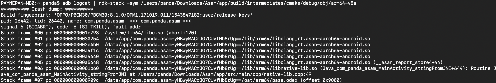

# AddressSanitizerDemo

AddressSanitizer native memory check demo

```json
9-02-13 20:01:48.197 25077-25077/? I/wrap.sh: ==25083==ERROR: AddressSanitizer: heap-buffer-overflow on address 0x00310002a790 at pc 0x0077f45e5b64 bp 0x007fc758a630 sp 0x007fc758a628
2019-02-13 20:01:48.197 25077-25077/? I/wrap.sh: WRITE of size 4 at 0x00310002a790 thread T0 (com.panda.asam)
2019-02-13 20:01:48.225 25077-25077/? I/wrap.sh:     #0 0x77f45e5b63  (/data/app/com.panda.asam-aa9WIA8AYlzCvuGKb0LoJQ==/lib/arm64/libnative-lib.so+0x1b63)
2019-02-13 20:01:48.225 25077-25077/? I/wrap.sh:     #1 0x77f472309f  (/data/app/com.panda.asam-aa9WIA8AYlzCvuGKb0LoJQ==/oat/arm64/base.odex+0x909f)
2019-02-13 20:01:48.225 25077-25077/? I/wrap.sh: 0x00310002a792 is located 0 bytes to the right of 2-byte region [0x00310002a790,0x00310002a792)
2019-02-13 20:01:48.225 25077-25077/? I/wrap.sh: allocated by thread T0 (com.panda.asam) here:
2019-02-13 20:01:48.225 25077-25077/? I/wrap.sh:     #0 0x78923b58bf  (/data/app/com.panda.asam-aa9WIA8AYlzCvuGKb0LoJQ==/lib/arm64/libclang_rt.asan-aarch64-android.so+0x9f8bf)
2019-02-13 20:01:48.225 25077-25077/? I/wrap.sh:     #1 0x77f45e5a8f  (/data/app/com.panda.asam-aa9WIA8AYlzCvuGKb0LoJQ==/lib/arm64/libnative-lib.so+0x1a8f)
2019-02-13 20:01:48.225 25077-25077/? I/wrap.sh:     #2 0x77f472309f  (/data/app/com.panda.asam-aa9WIA8AYlzCvuGKb0LoJQ==/oat/arm64/base.odex+0x909f)
2019-02-13 20:01:48.226 25077-25077/? I/wrap.sh:     #3 0x780bedef77  (/system/lib64/libart.so+0xdcf77)
2019-02-13 20:01:48.226 25077-25077/? I/wrap.sh:     #4 0x780c09ca53  (/system/lib64/libart.so+0x29aa53)
2019-02-13 20:01:48.226 25077-25077/? I/wrap.sh:     #5 0x780c09703b  (/system/lib64/libart.so+0x29503b)
2019-02-13 20:01:48.226 25077-25077/? I/wrap.sh:     #6 0x780c334d43  (/system/lib64/libart.so+0x532d43)
2019-02-13 20:01:48.226 25077-25077/? I/wrap.sh:     #7 0x780c33ea97  (/system/lib64/libart.so+0x53ca97)
2019-02-13 20:01:48.226 25077-25077/? I/wrap.sh:     #8 0x780c07749f  (/system/lib64/libart.so+0x27549f)
2019-02-13 20:01:48.226 25077-25077/? I/wrap.sh:     #9 0x780c327903  (/system/lib64/libart.so+0x525903)
2019-02-13 20:01:48.226 25077-25077/? I/wrap.sh:     #10 0x780c355f0f  (/system/lib64/libart.so+0x553f0f)
2019-02-13 20:01:48.226 25077-25077/? I/wrap.sh: SUMMARY: AddressSanitizer: heap-buffer-overflow (/data/app/com.panda.asam-aa9WIA8AYlzCvuGKb0LoJQ==/lib/arm64/libnative-lib.so+0x1b63) 
2019-02-13 20:01:48.227 25077-25077/? I/wrap.sh: Shadow bytes around the buggy address:
2019-02-13 20:01:48.227 25077-25077/? I/wrap.sh:   0x0016200054a0: fa fa 00 00 fa fa fa fa fa fa fa fa fa fa fa fa
2019-02-13 20:01:48.227 25077-25077/? I/wrap.sh:   0x0016200054b0: fa fa fa fa fa fa fa fa fa fa fa fa fa fa fa fa
2019-02-13 20:01:48.227 25077-25077/? I/wrap.sh:   0x0016200054c0: fa fa fa fa fa fa fa fa fa fa fa fa fa fa fa fa
2019-02-13 20:01:48.227 25077-25077/? I/wrap.sh:   0x0016200054d0: fa fa 04 fa fa fa fd fa fa fa fa fa fa fa fa fa
2019-02-13 20:01:48.227 25077-25077/? I/wrap.sh:   0x0016200054e0: fa fa fd fa fa fa fd fd fa fa fd fa fa fa fa fa
2019-02-13 20:01:48.227 25077-25077/? I/wrap.sh: =>0x0016200054f0: fa fa[02]fa fa fa fd fa fa fa fd fa fa fa fd fa
2019-02-13 20:01:48.227 25077-25077/? I/wrap.sh:   0x001620005500: fa fa fd fa fa fa 03 fa fa fa 00 fa fa fa 00 00
2019-02-13 20:01:48.227 25077-25077/? I/wrap.sh:   0x001620005510: fa fa 00 00 fa fa 00 00 fa fa fd fd fa fa 04 fa
2019-02-13 20:01:48.227 25077-25077/? I/wrap.sh:   0x001620005520: fa fa 04 fa fa fa 04 fa fa fa 04 fa fa fa 04 fa
2019-02-13 20:01:48.227 25077-25077/? I/wrap.sh:   0x001620005530: fa fa 00 fa fa fa 00 00 fa fa fd fa fa fa fd fa
2019-02-13 20:01:48.227 25077-25077/? I/wrap.sh:   0x001620005540: fa fa fd fa fa fa fd fa fa fa 02 fa fa fa 04 fa
2019-02-13 20:01:48.227 25077-25077/? I/wrap.sh: Shadow byte legend (one shadow byte represents 8 application bytes):
2019-02-13 20:01:48.227 25077-25077/? I/wrap.sh:   Addressable:           00
2019-02-13 20:01:48.227 25077-25077/? I/wrap.sh:   Partially addressable: 01 02 03 04 05 06 07 
2019-02-13 20:01:48.227 25077-25077/? I/wrap.sh:   Heap left redzone:       fa
2019-02-13 20:01:48.227 25077-25077/? I/wrap.sh:   Freed heap region:       fd
2019-02-13 20:01:48.227 25077-25077/? I/wrap.sh:   Stack left redzone:      f1
2019-02-13 20:01:48.227 25077-25077/? I/wrap.sh:   Stack mid redzone:       f2
2019-02-13 20:01:48.227 25077-25077/? I/wrap.sh:   Stack right redzone:     f3
2019-02-13 20:01:48.227 25077-25077/? I/wrap.sh:   Stack after return:      f5
2019-02-13 20:01:48.227 25077-25077/? I/wrap.sh:   Stack use after scope:   f8
2019-02-13 20:01:48.227 25077-25077/? I/wrap.sh:   Global redzone:          f9
2019-02-13 20:01:48.227 25077-25077/? I/wrap.sh:   Global init order:       f6
2019-02-13 20:01:48.227 25077-25077/? I/wrap.sh:   Poisoned by user:        f7
2019-02-13 20:01:48.227 25077-25077/? I/wrap.sh:   Container overflow:      fc
2019-02-13 20:01:48.227 25077-25077/? I/wrap.sh:   Array cookie:            ac
2019-02-13 20:01:48.227 25077-25077/? I/wrap.sh:   Intra object redzone:    bb
2019-02-13 20:01:48.227 25077-25077/? I/wrap.sh:   ASan internal:           fe
2019-02-13 20:01:48.227 25077-25077/? I/wrap.sh:   Left alloca redzone:     ca
2019-02-13 20:01:48.227 25077-25077/? I/wrap.sh:   Right alloca redzone:    cb
2019-02-13 20:01:48.227 25077-25077/? I/wrap.sh: ==25083==ABORTING

019-02-13 20:01:48.270 25188-25188/? A/DEBUG: *** *** *** *** *** *** *** *** *** *** *** *** *** *** *** ***
2019-02-13 20:01:48.270 25188-25188/? A/DEBUG: Build fingerprint: 'OPPO/PBCM30/PBCM30:8.1.0/OPM1.171019.011/1543847182:user/release-keys'
2019-02-13 20:01:48.270 25188-25188/? A/DEBUG: Revision: '0'
2019-02-13 20:01:48.270 25188-25188/? A/DEBUG: ABI: 'arm64'
2019-02-13 20:01:48.270 25188-25188/? A/DEBUG: pid: 25083, tid: 25083, name: com.panda.asam  >>> com.panda.asam <<<
2019-02-13 20:01:48.270 25188-25188/? A/DEBUG: signal 6 (SIGABRT), code -6 (SI_TKILL), fault addr --------
2019-02-13 20:01:48.271 25188-25188/? A/DEBUG: Abort message: '=================================================================
    ==25083==ERROR: AddressSanitizer: heap-buffer-overflow on address 0x00310002a790 at pc 0x0077f45e5b64 bp 0x007fc758a630 sp 0x007fc758a628
    WRITE of size 4 at 0x00310002a790 thread T0 (com.panda.asam)
        #0 0x77f45e5b63  (/data/app/com.panda.asam-aa9WIA8AYlzCvuGKb0LoJQ==/lib/arm64/libnative-lib.so+0x1b63)
        #1 0x77f472309f  (/data/app/com.panda.asam-aa9WIA8AYlzCvuGKb0LoJQ==/oat/arm64/base.odex+0x909f)
    
    0x00310002a792 is loca
2019-02-13 20:01:48.271 25188-25188/? A/DEBUG:     x0   0000000000000000  x1   00000000000061fb  x2   0000000000000006  x3   0000000000000008
2019-02-13 20:01:48.271 25188-25188/? A/DEBUG:     x4   0000000000000000  x5   0000000000000000  x6   0000000000000000  x7   0000000000000000
2019-02-13 20:01:48.271 25188-25188/? A/DEBUG:     x8   0000000000000083  x9   0000000010000000  x10  0000007fc7589910  x11  7e99d93120b04538
2019-02-13 20:01:48.271 25188-25188/? A/DEBUG:     x12  7e99d93120b04538  x13  0000000000000020  x14  ffffffffffffffdf  x15  0000000000000002
2019-02-13 20:01:48.271 25188-25188/? A/DEBUG:     x16  0000000e19ef4fa8  x17  00000078931f5540  x18  0000000000000000  x19  00000000000061fb
2019-02-13 20:01:48.271 25188-25188/? A/DEBUG:     x20  00000000000061fb  x21  0000000000000083  x22  00000078924d8450  x23  0000007892ce2240
2019-02-13 20:01:48.271 25188-25188/? A/DEBUG:     x24  00000077f45e5b64  x25  0000000000000001  x26  0000004500004920  x27  0000000000000001
2019-02-13 20:01:48.271 25188-25188/? A/DEBUG:     x28  0000000000000001  x29  0000007fc7589950  x30  000000789319e770
2019-02-13 20:01:48.271 25188-25188/? A/DEBUG:     sp   0000007fc7589910  pc   000000789319e798  pstate 0000000060000000
2019-02-13 20:01:48.274 25188-25188/? A/DEBUG: backtrace:
2019-02-13 20:01:48.274 25188-25188/? A/DEBUG:     #00 pc 000000000001e798  /system/lib64/libc.so (abort+120)
2019-02-13 20:01:48.274 25188-25188/? A/DEBUG:     #01 pc 0000000000030254  /data/app/com.panda.asam-aa9WIA8AYlzCvuGKb0LoJQ==/lib/arm64/libclang_rt.asan-aarch64-android.so
2019-02-13 20:01:48.274 25188-25188/? A/DEBUG:     #02 pc 000000000002e4b0  /data/app/com.panda.asam-aa9WIA8AYlzCvuGKb0LoJQ==/lib/arm64/libclang_rt.asan-aarch64-android.so
2019-02-13 20:01:48.274 25188-25188/? A/DEBUG:     #03 pc 00000000000a4f1c  /data/app/com.panda.asam-aa9WIA8AYlzCvuGKb0LoJQ==/lib/arm64/libclang_rt.asan-aarch64-android.so
2019-02-13 20:01:48.274 25188-25188/? A/DEBUG:     #04 pc 00000000000a4640  /data/app/com.panda.asam-aa9WIA8AYlzCvuGKb0LoJQ==/lib/arm64/libclang_rt.asan-aarch64-android.so
2019-02-13 20:01:48.274 25188-25188/? A/DEBUG:     #05 pc 00000000000a5648  /data/app/com.panda.asam-aa9WIA8AYlzCvuGKb0LoJQ==/lib/arm64/libclang_rt.asan-aarch64-android.so (__asan_report_store4+44)
2019-02-13 20:01:48.274 25188-25188/? A/DEBUG:     #06 pc 0000000000001b60  /data/app/com.panda.asam-aa9WIA8AYlzCvuGKb0LoJQ==/lib/arm64/libnative-lib.so (Java_com_panda_asam_MainActivity_stringFromJNI+644)
2019-02-13 20:01:48.274 25188-25188/? A/DEBUG:     #07 pc 000000000000909c  /data/app/com.panda.asam-aa9WIA8AYlzCvuGKb0LoJQ==/oat/arm64/base.odex (offset 0x9000)
```

然后通过ndk里面的分析工具：



